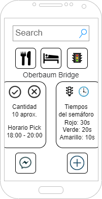

  

# Artist on the street

Aplicación para ayudar a los artistas callejeros a encontrar lugares idóneos para trabajar, comer, alojarse y mucho más.

## Mockups

 

## Referencias

- [Configurar enrutador](https://levelup.gitconnected.com/set-up-a-vue-app-running-on-vite-e816247a24e2) o también [aqui](https://aymanemx.com/posts/set-up-vue-app-running-on-vite/)
- [Juggling icons created by Vectors Market - Flaticon](https://www.flaticon.com/free-icons/juggling)